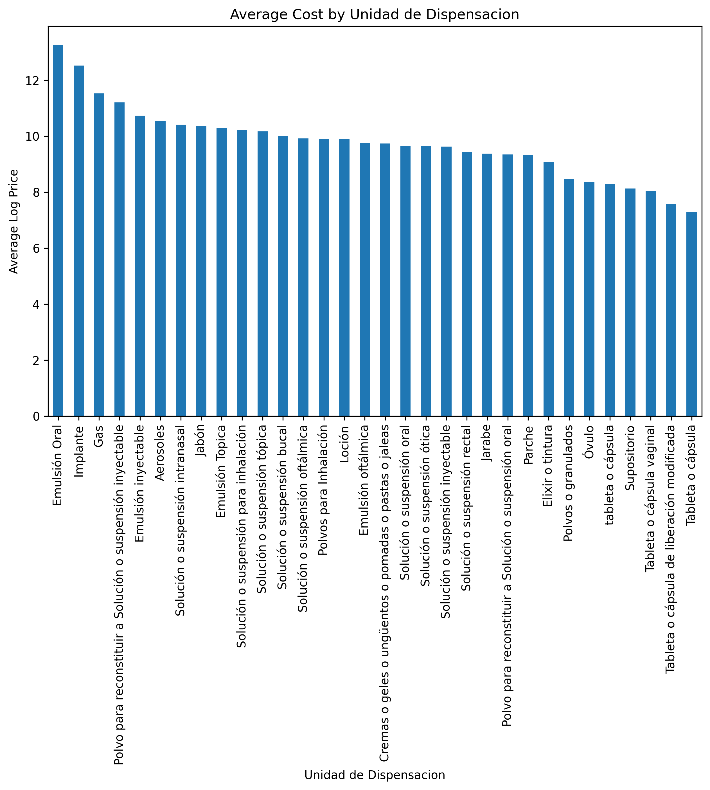
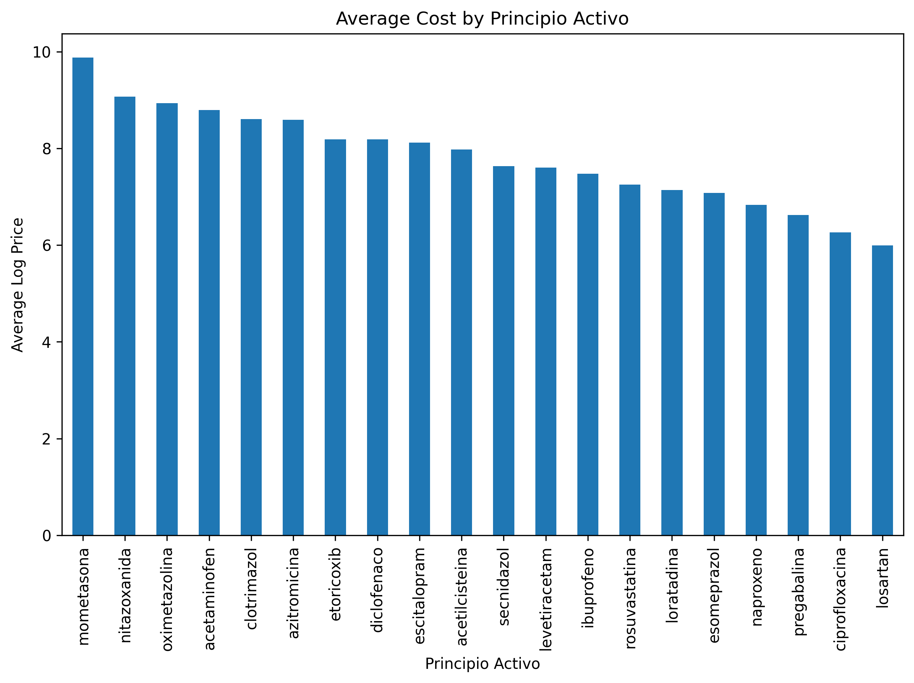
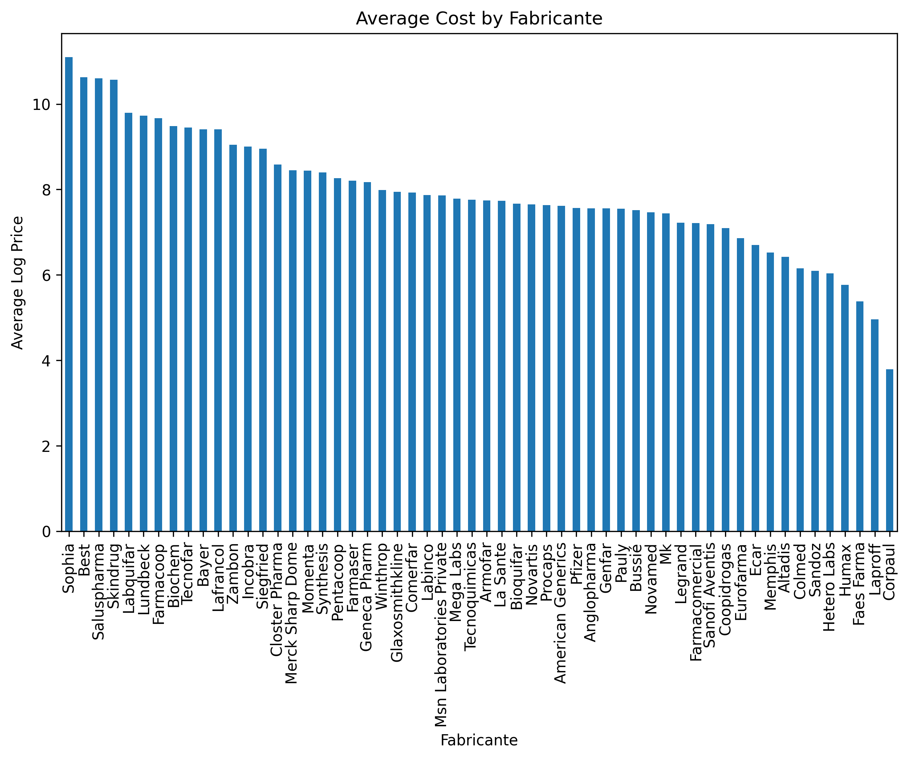

### Informe de Análisis sobre los Factores de Precios de Medicamentos

**Nota**: Este es un proyecto de aprendizaje y no está destinado a ser utilizado en escenarios de toma de decisiones reales. Como proyecto de aprendizaje, está abierto a mejoras y mejoras. Las iteraciones y refinamientos adicionales pueden ayudar a aumentar la robustez y aplicabilidad de los hallazgos.

### Informe de Análisis sobre los Factores de Precios de Medicamentos

#### 1. Introducción
Este informe presenta un análisis de los factores que influyen en el costo de los medicamentos. El estudio utiliza datos sobre varios atributos, incluyendo la unidad de dispensación, los principios activos, los fabricantes, la concentración y los canales de distribución. El análisis se realiza utilizando la regresión XGBoost para determinar la importancia de estas características en la predicción de los precios de los medicamentos. Los datos utilizados en este estudio provienen de [Clicsalud - Termómetro de Precios de Medicamentos](https://www.datos.gov.co/Salud-y-Protecci-n-Social/Clicsalud-Term-metro-de-Precios-de-Medicamentos/n4dj-8r7k/about_data).

#### 2. Entendiendo los Precios Logarítmicos
En este análisis, los precios se refieren como "precios logarítmicos" porque se ha utilizado el logaritmo de los precios reales. Transformar los precios utilizando el logaritmo natural ayuda a estabilizar la varianza y hacer que la distribución sea más similar a una normal. Esta transformación es particularmente útil para reducir el impacto de los valores atípicos y los datos sesgados, permitiendo un análisis y modelado estadístico más preciso y confiable.

#### 3. Costo Promedio por Unidad de Dispensación
El análisis de los costos promedio por unidad de dispensación revela una variabilidad significativa:

- **Costos Promedios Más Altos**: Las unidades de dispensación con los precios logarítmicos promedio más altos son "Emulsión Oral," "Implante," y "Gas." Estas formas probablemente incurren en mayores costos de producción o empaque, contribuyendo a sus precios elevados.
- **Tendencia General**: La variabilidad en los costos indica que la forma en que se dispensa el medicamento juega un papel crucial en su precio. Esto puede atribuirse a diferencias en los procesos de fabricación, los requisitos de materiales y los mecanismos de entrega.



#### 4. Costo Promedio por Principio Activo
Los costos promedio asociados con diferentes principios activos también muestran diferencias sustanciales:

- **Costos Promedios Más Altos**: "mometasona," "nitazoxanida," y "oximetazolina" son los principios activos con los precios logarítmicos promedio más altos. Estas diferencias pueden resultar de la rareza de los ingredientes, su importancia terapéutica o mayores costos de producción.
- **Variación de Costos**: La significativa variación en los costos entre diferentes principios activos sugiere que la elección del principio activo es un determinante clave del precio del medicamento.



#### 5. Costo Promedio por Fabricante
Un análisis de los costos promedio por fabricante indica una amplia gama de precios:

- **Costos Promedios Más Altos**: Los fabricantes como "Sophia," "Sophia Beta," y "Salus Pharma" tienen los precios logarítmicos promedio más altos. Factores como la reputación de la marca, las capacidades de producción y las estrategias de mercado probablemente influyen en estos costos.
- **Influencia del Fabricante**: La variabilidad en los costos entre fabricantes subraya el impacto significativo del productor en el precio de los medicamentos, posiblemente debido a diferencias en la eficiencia de fabricación, la calidad y el valor de la marca.



#### 6. Importancia de las Características del Modelo XGBoost
El modelo de regresión XGBoost identifica la importancia relativa de diferentes características en la predicción de los precios de los medicamentos:

- **Características Más Importantes**: La unidad de dispensación ("unidad_de_dispensacion_encoded") es el predictor más importante del precio del medicamento. Esto es seguido por el principio activo ("principio_activo_encoded") y el fabricante ("fabricante_encoded").
- **Importancia Moderada**: La concentración del medicamento ("concentracion_en_gramos") y el número de factor ("numerofactor") tienen una importancia moderada.
- **Menor Importancia**: El canal de distribución ("canal_encoded") tiene el menor impacto en los precios.


#### 7. Comparación del Rendimiento del Modelo
Una comparación de las métricas de rendimiento del modelo a través de diferentes modelos de regresión resalta la efectividad de XGBoost:

| Modelo             | MAE      | RMSE     | MSE      | R^2       |
|-------------------|----------|----------|----------|-----------|
| Random Forest     | 0.9165   | 1.3330   | 1.7768   | 0.6524    |
| Gradient Boosting | 1.1391   | 1.5617   | 2.4388   | 0.5229    |
| **XGBoost**       | **0.8783** | **1.2574** | **1.5812** | **0.6907** |
| LightGBM          | 0.9578   | 1.3388   | 1.7924   | 0.6494    |
| CatBoost          | 0.9919   | 1.3719   | 1.8821   | 0.6318    |
| SVR               | 1.6848   | 2.2035   | 4.8555   | 0.0501    |

- **Rendimiento de XGBoost**: XGBoost supera a otros modelos, logrando el menor Error Absoluto Medio (MAE) y el menor Error Cuadrático Medio de la Raíz (RMSE), así como el valor más alto de R-cuadrado (R^2). Esto indica que XGBoost proporciona las predicciones más precisas para los precios de los medicamentos entre los modelos probados.

#### 8. Usando el Modelo
Para usar el modelo XGBoost entrenado para predecir los precios de los medicamentos, siga estos pasos:

1. **Cargar el Modelo y los Mapeos**:
    ```python
    import pandas as pd
    import joblib

    # Cargar el modelo
    loaded_model = joblib.load('./model.pkl')  # Reemplazar con la ruta real a su modelo

    # Cargar los datos de entrenamiento (suponiendo que train_df es su DataFrame de entrenamiento)
    train_df = pd.read_csv('./train_data.csv')  # Reemplazar con la ruta real a sus datos de entrenamiento

    # Crear mapeos a partir de los datos de entrenamiento
    unidad_de_dispensacion_mapping = train_df[['unidad_de_dispensacion', 'unidad_de_dispensacion_encoded']].drop_duplicates().set_index('unidad_de_dispensacion')['unidad_de_dispensacion_encoded'].to_dict()
    principio_activo_mapping = train_df[['principio_activo', 'principio_activo_encoded']].drop_duplicates().set_index('principio_activo')['principio_activo_encoded'].to_dict()
    fabricante_mapping = train_df[['fabricante', 'fabricante_encoded']].drop_duplicates().set_index('fabricante')['fabricante_encoded'].to_dict()
    canal_mapping = train_df[['canal', 'canal_encoded']].drop_duplicates().set_index('canal')['canal_encoded'].to_dict()
    ```

2. **Definir la Función de Predicción**:
    ```python
    def predict_entry(model, entry, unidad_de_dispensacion_mapping, principio_activo_mapping, fabricante_mapping, canal_mapping):
        """
        Predecir el resultado para una entrada dada utilizando el modelo entrenado.

        Parámetros:
        - model: Modelo entrenado cargado desde pickle
        - entry: Diccionario que contiene las características de entrada con nombres legibles para humanos
        - unidad_de_dispensacion_mapping: Diccionario de mapeo para unidad_de_dispensacion
        - principio_activo_mapping: Diccionario de mapeo para principio_activo
        - fabricante_mapping: Diccionario de mapeo para fabricante
        - canal_mapping: Diccionario de mapeo para canal

        Retorna:
        - Resultado de la predicción del modelo
        """
        try:
            # Mapear nombres legibles para humanos a valores codificados
            entry_encoded = {
                'unidad_de_dispensacion_encoded': unidad_de_dispensacion_mapping[entry['unidad_de_dispensacion']],
                'principio_activo_encoded': principio_activo_mapping[entry['principio_activo']],
                'fabricante_encoded': fabricante_mapping[entry['fabricante']],
                'concentracion_en_gramos': entry['concentracion_en_gramos'],
                'numerofactor': entry['numerofactor'],
                'canal_encoded': canal_mapping[entry['canal']]
            }
        except KeyError as e:
            raise ValueError(f"Error de mapeo: {e}. Por favor, asegúrese de que todos los valores estén correctamente mapeados.")

        # Convertir la entrada codificada a un DataFrame
        entry_df = pd.DataFrame([entry_encoded])

        # Asegurar que el orden de las columnas coincida con los datos de entrenamiento
        entry_df = entry_df[['unidad_de_dispensacion_encoded', 'principio_activo_encoded', 'fabricante_encoded', 'concentracion_en_gramos', 'numerofactor', 'canal_encoded']]

        # Predecir utilizando el modelo
        prediction = model.predict(entry_df)

        return prediction[0]  # Suponiendo que el modelo retorna una lista/array de predicciones
    ```

3. **Predecir Usando una Entrada de Ejemplo**:
    ```python
    # Ejemplo de entrada para predecir
    example_entry = {
        'unidad_de_dispensacion': 'Jarabe',
        'principio_activo': 'acido valproico',
        'fabricante': 'Novamed',
        'concentracion_en_gramos': 5,
        'numerofactor': 3,
        'canal': 'Comercial'
    }

    # Predecir utilizando la entrada de ejemplo
    result = predict_entry(loaded_model, example_entry, unidad_de_dispensacion_mapping, principio_activo_mapping, fabricante_mapping, canal_mapping)
    real_price_prediction = np.expm1(result)  # Revertir la transformación logarítmica

    print("Predicción:", real_price_prediction)
    ```

#### 9. Conclusión
El análisis demuestra que la forma del medicamento, los principios activos y los fabricantes son los principales factores que influyen en los precios de los medicamentos. La unidad de dispensación es el predictor más significativo, reflejando el impacto de los procesos de producción y empaque en los costos. Los principios activos y los fabricantes también juegan un papel crucial, destacando la importancia de la obtención de ingredientes y la reputación de la marca. La concentración y los canales de distribución tienen efectos menores pero aún notables en los precios.

XGBoost ha sido identificado como el modelo más efectivo para predecir los precios de los medicamentos, proporcionando una precisión superior en comparación con otros modelos. Estos hallazgos proporcionan una comprensión integral de los factores que afectan los costos de los medicamentos y pueden informar la toma de decisiones en la industria farmacéutica, desde la planificación de la producción hasta las estrategias de precios.

**Nota**: Este es un proyecto de aprendizaje y no está destinado a ser utilizado en escenarios de toma de decisiones reales. Como proyecto de aprendizaje, está abierto a mejoras y mejoras. Las iteraciones y refinamientos adicionales pueden ayudar a aumentar la robustez y aplicabilidad de los hallazgos.
